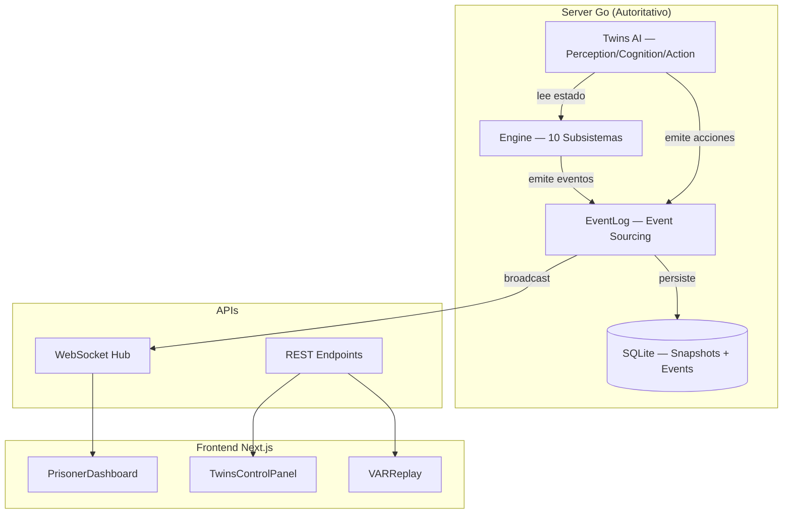

# Análisis Exhaustivo: La Cárcel de los Gemelos

## 1. Concepto del Juego

**La Cárcel de los Gemelos** es un RPG de supervivencia psicológica multijugador que simula un reality show de 21 días. Los participantes (presos) conviven en celdas compartidas en parejas (duos), enfrentándose al hambre, la sed, la falta de privacidad, las torturas sonoras y la traición. El juego culmina con el **Dilema del Prisionero clásico**: en el Día 21, cada duo decide si repartir el bote o traicionar a su compañero.

El servidor es **autoritativo**: toda la lógica se ejecuta en Go, los clientes solo reciben estado. Una IA autónoma ("Los Gemelos") toma decisiones de castigo/recompensa usando un framework ético propio + LLM externo.

---

## 2. Arquitectura Técnica

**Paquetes del servidor:**

| Paquete | Ruta | Rol |
|---------|------|-----|
| `domain/prisoner` | [prisoner.go](file:///d:/CarcelGemelosJuego/server/internal/domain/prisoner/prisoner.go) | Entidades puras: `Prisoner`, arquetipos, traits, estados temporales |
| `domain/rules` | [sanity.go](file:///d:/CarcelGemelosJuego/server/internal/domain/rules/sanity.go) | Funciones puras de cálculo (drenaje de cordura, etc.) |
| `events` | [eventlog.go](file:///d:/CarcelGemelosJuego/server/internal/events/eventlog.go) | Log inmutable append-only con 21 tipos de evento |
| `engine` | 14 archivos | Motor de simulación con 10 subsistemas |
| `twins` | 3 submódulos | IA autónoma con ciclo Percepción→Cognición→Acción |
| `infra/ai` | 4 archivos | Providers duales OpenAI + Anthropic con BudgetGate |
| `infra/storage` | 5 archivos | SQLite para eventos y snapshots de estado |
| `network` | 4 archivos | WebSocket hub + VAR Replay API |
| `platform/logger` | 3 archivos | Logging estructurado con niveles |

---

## 3. Funcionalidades Implementadas — Detalle por Subsistema

### 3.1 Ticker (Reloj del Juego)

**Archivo:** [ticker.go](file:///d:/CarcelGemelosJuego/server/internal/engine/ticker.go)

El corazón del juego. Cada **1 minuto real** avanza **2 horas de juego**, lo que significa que un día completo de juego dura **12 minutos reales**, y los 21 días se completan en **~4 horas reales**.

- Emite `TimeTickEvent` con metadatos: `GameDay`, `GameHour`, `IsNightTime` (22:00-06:00), `IsMealWindow` (08:00, 14:00, 20:00)
- Al alcanzar el Día 21, dispara automáticamente `FINAL_DILEMMA_START` y detiene el ticker
- Soporta hot-reload del reloj desde la base de datos (`SetTime`) para recuperación tras reinicio

> [!NOTE]
> El TickRate de 1 minuto es agresivo para producción. Para un stream real de 21 días, necesitaría 1 tick = 1 hora real. Actualmente está calibrado para demos.

---

### 3.2 Sistema de Cordura (Sanity)

**Archivo:** [sanity_system.go](file:///d:/CarcelGemelosJuego/server/internal/engine/sanity_system.go) — 262 líneas

El sistema más completo del motor. Gestiona:

- **Drenaje por ruido:** Calcula daño usando las reglas puras de `domain/rules`, aplica multiplicadores por arquetipo (Mystic mitiga, ShortFuse amplifica 2x), y emite `SanityChangeEvent` para auditoría
- **Toilet of Shame:** Cuando un preso usa el WC, pierde 15 de Dignidad. Si su compañero de celda NO está mirando a la pared (`StateFacingWall`), ambos sufren daño de cordura (20 al testigo, 10 al usuario por vergüenza). Los Místicos mitigan el daño a la mitad
- **Insultos:** El payload `InsultPayload` lleva severidad base. Dakota (ShortFuse) recibe el doble de daño
- **Audio Torture:** Las torturas sonoras inescapables (bebés llorando, sirenas) reusan la lógica de ruido pero el cliente las trata de forma diferente (bypass de volumen)
- **Regeneración por tick:** Frank Cuesta (TraitMisanthrope) regenera +2 cordura/tick SOLO cuando está solo en su celda

---

### 3.3 Sistema Social

**Archivo:** [social_system.go](file:///d:/CarcelGemelosJuego/server/internal/engine/social_system.go) — 200 líneas

Gestiona la dinámica de parejas:

- **Duo Tóxico (Labrador & Ylenia):** El trait `BadRomance` causa drenaje de cordura (-2/tick) cuando ambos están en la misma celda. Pero los emotes agresivos entre ellos generan +10 `PotContribution` (Hype). Deben pelear para ganar dinero, pero separarse para no volverse locos
- **Loyalty Bar:** Si la lealtad de un preso supera 80, regenera +1 cordura/tick pasivamente
- **Dilema Final (Día 21):** Implementación completa del Dilema del Prisionero:
  - `COLLABORATE + COLLABORATE` → 50/50 del bote
  - `BETRAY + COLLABORATE` → el traidor se lleva todo
  - `BETRAY + BETRAY` → ambos pierden, gana la casa
  - Emite `DILEMMA_OUTCOME` events para auditoría

---

### 3.4 Sistema de Metabolismo

**Archivo:** [metabolism_system.go](file:///d:/CarcelGemelosJuego/server/internal/engine/metabolism_system.go) — 135 líneas

- **Decay por tick:** Hambre -2, Sed -3 cada tick
- **Inanición:** Hambre ≤ 0 → -5 HP/tick. Deshidratación → -10 HP/tick (más rápido)
- **Breatharian (Tartaria):** No sufre hambre pero pierde Stamina -1/tick. Si come comida sólida: -50 cordura, -20 HP (castigo severo por violar su "ascetismo")
- **Ingesta:** Agua restaura sed, el resto restaura hambre. Cap en 100

> [!WARNING]
> El sistema NO emite eventos al EventLog cuando los vitales cambian por metabolismo. Esto rompe el contrato de Event Sourcing para reconstrucción de estado.

---

### 3.5 Sistema de Caos

**Archivo:** [system_chaos.go](file:///d:/CarcelGemelosJuego/server/internal/engine/system_chaos.go) — 164 líneas

Gestiona las habilidades activas de los "Agentes del Caos":

- **Poltergeist (Aída — TraitInsomniac):** Durante el lockdown nocturno, Aída puede golpear los barrotes de celdas vecinas. Esto emite un `NoiseEvent` de intensidad 3 dirigido a la celda objetivo, que a su vez activa el SanitySystem. Los vecinos no pueden escapar porque las puertas están cerradas
- **Smooth Criminal (Héctor — TraitSmoothCriminal):** Cuando Héctor roba, el evento de robo se marca como `IsRevealed: false` y se programa su revelación 12 horas de juego después. Esto permite a Héctor robar sin que el VAR lo muestre inmediatamente. Cuando el timer expira, se emite un `SECRET_REVEALED` event que apunta al evento oculto original

---

### 3.6 Sistema de Lockdown

**Archivo:** [lockdown_system.go](file:///d:/CarcelGemelosJuego/server/internal/engine/lockdown_system.go)

Cierre automático de celdas a las 22:00 (`DOOR_LOCK`) y apertura a las 06:00 (`DOOR_OPEN`). Si no has acumulado comida/agua antes del cierre, te quedas sin recursos hasta la mañana.

---

### 3.7 Sistema de Ruido (NoiseManager)

**Archivo:** [noise.go](file:///d:/CarcelGemelosJuego/server/internal/engine/noise.go) — 4.4 KB

Gestiona la generación y scheduling de eventos de ruido. Tipos: `SIREN`, `CRYING_BABY`, `SCRATCHING`, `BANGING_BARS`. Cada ruido tiene intensidad, duración y zona objetivo. La IA Gemelos usa este manager directamente para ejecutar castigos.

---

### 3.8 Sistema de Aislamiento

**Archivo:** [isolation_system.go](file:///d:/CarcelGemelosJuego/server/internal/engine/isolation_system.go)

Celda de castigo. Los Gemelos pueden enviar a un preso aquí separándolo de su duo por 24h de juego. El preso aislado no puede interactuar, comerciar, ni participar en el Patio Challenge. Para Frank (Misántropo), esto es un buff de cordura; para los Tóxicos, corta su fuente de Hype.

---

### 3.9 Sistema de Encuestas (Polling)

**Archivo:** [polling_system.go](file:///d:/CarcelGemelosJuego/server/internal/engine/polling_system.go) — 5.7 KB

API completa para que la audiencia vote:
- Crear poll con opciones
- Votar (un voto por poll)
- Resolución automática por timer o manual
- Emite `POLL_CREATED` y `POLL_RESOLVED` events

---

### 3.10 Sistema de Patio (Reto Diario)

**Archivo:** [patio_system.go](file:///d:/CarcelGemelosJuego/server/internal/engine/patio_system.go)

A las 12:00 de cada día, selecciona un prisionero (no aislado, no sleeper) y le aplica un reto que cuesta 80 de Stamina. La recompensa depende de la Dignidad del participante (multiplicador x2 si Dignidad > 80). Aporta al bote compartido.

> [!IMPORTANT]
> El sistema confunde Stamina con Hunger en el código (`chosenOne.Hunger += staminaCost`). Debería decrementar `Stamina`, no incrementar `Hunger`.

---

### 3.11 Sistema de Contrabando

**Archivo:** [contraband_system.go](file:///d:/CarcelGemelosJuego/server/internal/engine/contraband_system.go)

- **GenerateLoot:** Los Gemelos o un cron pueden dejar objetos ocultos en las celdas. Otorgan buff de cordura y marcan al preso como portador de contrabando
- **Snitching:** Un preso puede delatar a otro ante Los Gemelos. Si el objetivo realmente tiene contrabando → éxito: el soplón roba 500 del bote, el objetivo pierde 40 cordura y va a aislamiento. Si miente → castigo: el soplón pierde 30 cordura. En ambos casos, pierde 20 lealtad

---

### 3.12 IA "Los Gemelos" (Twins)

**Archivos:** [mind.go](file:///d:/CarcelGemelosJuego/server/internal/twins/mind.go), [cognitor.go](file:///d:/CarcelGemelosJuego/server/internal/twins/cognition/cognitor.go)

Ciclo autónomo cada 5 minutos reales:

1. **Percepción:** Construye `PrisonState` leyendo el EventLog y los vitales actuales de cada preso
2. **Cognición (MAD-BAD-SAD):**
   - **MAD (Morally Absolute Denial):** Reglas inviolables — nunca drenar cordura por debajo de 5 si ya hay alguien en breakdown, nunca castigar dos veces seguidas al mismo objetivo
   - **BAD (Bounded Acceptable Damage):** Intensidad máxima proporcional a la cordura media
   - **SAD (Spectacle Amplification Directive):** Si todos están "estables" (cordura > 60), aplica castigo para generar drama; si hay conflicto social activo, amplificarlo; si alguien está roto (cordura < 20), observar
3. **Acción:** Ejecuta decisiones emitiendo eventos al log (NoiseEvent, AudioTorture, Lockdown, RevealSecret, Reward, DoNothing)

**Integración LLM:** Dual provider OpenAI + Anthropic con Constitutional Prompting (inyecta la "constitución" del juego + formato JSON de Chain-of-Thought). BudgetGate limita gasto a $10/día y $50/mes. El modo Shadow compara decisiones del LLM vs reglas locales sin ejecutarlas.

---

### 3.13 Event Sourcing ("El VAR de la Traición")

**Archivo:** [eventlog.go](file:///d:/CarcelGemelosJuego/server/internal/events/eventlog.go)

Log inmutable en memoria con write-through asíncrono a SQLite. 21 tipos de evento definidos. Queries por actor, por día, y replay completo. Cada evento tiene: ID único, timestamp, tipo, actor, target, payload arbitrario, día de juego, y flag de revelación.

---

### 3.14 VAR Replay API

**Archivo:** [var_replay.go](file:///d:/CarcelGemelosJuego/server/internal/network/var_replay.go)

3 endpoints:
- `GET /api/var/replay` — Timeline filtrable (por día, tipo, solo revelados)
- `GET /api/var/event` — Detalle de un evento específico
- `GET /api/var/stats` — Estadísticas agregadas (total eventos, traiciones, cambios de cordura)

Transforma eventos internos a formato público sanitizado con resúmenes legibles en español.

---

### 3.15 Frontend "El Panóptico"

| Componente | Archivo | Funcionalidad |
|------------|---------|---------------|
| **PrisonerDashboard** | [PrisonerDashboard.tsx](file:///d:/CarcelGemelosJuego/client/src/components/PrisonerDashboard.tsx) (9.7 KB) | Barras de vitales en tiempo real, conexión WebSocket, estados visuales |
| **TwinsControlPanel** | [TwinsControlPanel.tsx](file:///d:/CarcelGemelosJuego/client/src/components/TwinsControlPanel.tsx) (12.5 KB) | Historial de decisiones IA, botón Force Decision, toggles de Shadow Mode |
| **VARReplay** | [VARReplay.tsx](file:///d:/CarcelGemelosJuego/client/src/components/VARReplay.tsx) (9.7 KB) | Timeline visual de eventos, filtros, detalle expandible |
| **Header** | [Header.tsx](file:///d:/CarcelGemelosJuego/client/src/components/Header.tsx) (4 KB) | Navegación entre secciones |

---

### 3.16 Infraestructura y DevOps

- **SQLite:** Persistencia de eventos y snapshots de estado de prisioneros
- **Docker:** Multi-stage builds (Go + Next.js), docker-compose con servicios definidos
- **GitHub Actions:** Pipeline CI/CD configurado
- **Backup automático:** Goroutine que persiste snapshots cada 5 segundos

---

## 4. Gaps y Funcionalidades Pendientes

### 🔴 Críticos — Sin estos, el juego no es jugable

#### Gap 1: Sistema de Celdas y Duos
**Estado:** No implementado.

El `Prisoner` tiene un campo `CellID` pero **nunca se asigna** en el seed ni en el bootstrap. Toda la lógica social (Loyalty, Toxic Duo proximity, Dilema Final, cellmate lookup) depende de que los presos estén correctamente emparejados. Actualmente, `getCellmate()` siempre devuelve `nil` porque todos los `CellID` están vacíos.

**Impacto:** La mecánica central del juego (convivencia en parejas) no funciona.

**Qué falta:**
- Asignación de `CellID` en el seed data de `main.go`
- Lógica de reasignación cuando un preso va a aislamiento
- Validación de que cada celda tiene exactamente 2 presos

---

#### Gap 2: Sistema de Inventario y Economía
**Estado:** No existe.

La spec define "The Rice Standard" como economía del juego: arroz gratis (supervivencia), sushi/burguers/cigarrillos de pago (Hype o dinero real). Tartaria debería empezar con "Placebo Artifacts" comerciables. Nada de esto está implementado.

`PotContribution` existe como campo numérico pero no hay:
- Inventario de ítems por preso
- Tipos de ítems definidos (solo strings sueltos en payloads)
- Bote compartido del duo
- Sistema de trading entre presos
- Conexión entre Hype generado por los Tóxicos y la economía real

**Impacto:** El contrabando, el snitching, la economía y los Patio rewards no tienen contexto real.

---

#### Gap 3: Interfaz del Jugador
**Estado:** No existe.

El frontend "El Panóptico" es exclusivamente un panel de administración/monitoreo. **No hay interfaz para que un prisionero ejecute acciones**: comer, beber, usar el WC, insultar, robar, hacer emotes, o decidir en el Dilema Final.

**Qué falta:**
- Vista de jugador con su celda, inventario y vitales
- Controles de acción que emitan eventos al server
- Autenticación por rol (admin vs jugador vs audiencia)

---

#### Gap 4: Combate Físico
**Estado:** No existe.

El trait ShortFuse de Dakota promete "double physical damage at <30 sanity" pero no hay sistema de combate. No existe ningún `CombatSystem` ni payload de daño físico. Solo existen insultos (daño de cordura).

---

#### Gap 5: Visibilidad / Line of Sight
**Estado:** Placeholder.

La spec describe un "frustum check de cámara" para la mecánica del WC (¿el compañero está mirando o giró la cabeza?). Actualmente se usa un booleano binario `StateFacingWall` sin ningún sistema que lo active o desactive automáticamente. El toggle es manual.

---

#### Gap 6: Rutas VAR no registradas
**Estado:** Código escrito pero inactivo.

`VARReplayHandler.RegisterRoutes()` define 3 endpoints pero **nunca se llama** en [main.go](file:///d:/CarcelGemelosJuego/server/cmd/jail-server/main.go). Los endpoints `/api/var/replay`, `/api/var/event` y `/api/var/stats` no están activos en el servidor.

---

### 🟡 Medios — Funcionalidad parcial o stubs

#### Gap 7: Stamina sin sistema propio
El campo `Stamina` existe y se inicializa a 100, pero no hay sistema dedicado. El `PatioSystem` además **confunde Stamina con Hunger** en su código (`chosenOne.Hunger += staminaCost` cuando debería ser `chosenOne.Stamina -= staminaCost`). No hay regeneración por sueño ni drenaje por actividad.

#### Gap 8: Sueño / Fatiga
No existe sistema de sueño. El trait `Insomniac` de Aída dice "50% menos sueño" pero nadie necesita dormir. La Stamina no se regenera de noche. El Lockdown nocturno existe pero no tiene efecto mecánico real sobre la fatigue.

#### Gap 9: Muerte / Eliminación
Cuando `HP <= 0`, el `MetabolismSystem` solo imprime un warning. No hay evento de muerte, eliminación, ni transición a estado "Sleeper forzado". Un preso puede estar indefinidamente en HP negativo.

#### Gap 10: Reconstructor de estado incompleto
El bootstrap en `main.go` solo restaura `Sanity`, `Dignity` e `IsIsolated` desde snapshots. Los campos `Hunger`, `Thirst`, `HP`, `Stamina`, `Loyalty`, `Empathy`, `PotContribution`, `DayInGame` y `Traits` se pierden en cada reinicio del servidor.

#### Gap 11: Eventos de metabolismo sin Event Sourcing
El `MetabolismSystem` muta estado directamente (Hunger, Thirst, HP) sin emitir eventos al EventLog. Esto rompe la capacidad del VAR de reconstruir el historial completo ("Reality Recap").

#### Gap 12: Resúmenes del VAR limitados
`summarizeEvent()` solo cubre 4 tipos de evento (Noise, SanityChange, Betrayal, TimeTick). Los 17+ tipos restantes devuelven "Algo ocurrió...". El VAR pierde valor informativo.

---

### 🟢 Bajos — Polish y deuda técnica

| # | Gap | Detalle |
|---|-----|---------|
| 13 | **Bench mecánica** | Falete y La Marrash están listados como reservas en la spec pero no hay código para inyectar nuevos jugadores mid-game |
| 14 | **Moderación NLP** | El plan menciona moderación NLP en el EnvironmentService. No implementada |
| 15 | **Binary Serialization** | El plan dice Protobuf para movimiento. Todo es JSON actualmente |
| 16 | **PostgreSQL / Redis** | Plan referencia Postgres+Redis para producción. Solo hay SQLite. Docker compose define servicios pero el código no los usa |
| 17 | **Load Testing** | T029-T031 marcados como completados pero no hay herramienta de carga en el repo |
| 18 | **shadow_mode.go no compila** | El test de Shadow Mode llama a `NewPerceiver` y `NewCognitor` con firmas antiguas. Genera errores de compilación |

---

## 5. Evaluación de Madurez

| Área | Nivel | Justificación |
|------|-------|---------------|
| **Motor de juego** | 🟡 70% | 10 subsistemas funcionales con lógica de traits correcta, pero sin integración real (celdas vacías, sin inventario) |
| **IA Gemelos** | 🟢 80% | Framework MAD-BAD-SAD sólido, dual LLM con budget control, Constitutional Prompting. Pendiente: día actual como TODO |
| **Event Sourcing** | 🟡 60% | Log funcional pero inconsistente: algunos sistemas no emiten eventos (Metabolism, Loot recién corregido) y snapshot incompleto |
| **Frontend** | 🔴 35% | Solo panel admin. Sin UX de jugador. Buena base visual pero limitada a monitoreo |
| **Tests** | 🔴 25% | 4 tests unitarios, 0 de integración, shadow_mode no compila |
| **DevOps** | 🟡 55% | Docker funcional, CI existe, pero infra de producción (Postgres/Redis) solo definida en compose sin código que la use |

---

## 6. Las 5 Prioridades Recomendadas

1. **Asignación de Celdas y Duos** — Asignar `CellID` en el seed, emparejar los 3 duos (Frank+TBD, Labrador+Ylenia, Aída+Dakota o Héctor). Sin esto el Dilema Final, Loyalty y las mecánicas sociales no funcionan

2. **Inventario + Economía Rice Standard** — Definir tipos de ítems, inventario por preso, bote compartido del duo, y mecánica de trading. Desbloquea el contrabando real, los Placebo Artifacts del Místico y las recompensas del Patio

3. **Snapshot completo + Event Sourcing consistente** — Persistir TODOS los campos del Prisoner en el backup. Hacer que Metabolism y Patio emitan eventos. Registrar las rutas VAR en `main.go`

4. **Fix del PatioSystem (Stamina vs Hunger)** — Corregir el bug que aplica el coste a Hunger en vez de Stamina. Implementar regeneración de Stamina por sueño nocturno

5. **Interfaz de jugador** — API/WebSocket para acciones del jugador (comer, WC, insultar, robar, decidir en el Dilema). Sin esto, el juego solo se puede observar, no jugar
