# Hoja de Ruta: Implementación Detallada

## Mapa de Dependencias entre Fases


> [!IMPORTANT]
> **F1 es el fundamento de todo.** Sin asignación de celdas, los sistemas Social, Isolation, Toilet, Chaos y Dilema no funcionan en producción. Cada fase posterior depende de F1.

---

## F1: Sistema de Celdas y Duos 🔴

**Prioridad:** Máxima — bloquea F2, F3 y F5

### Interrelaciones
- **SocialSystem:** `getCellmate()` busca por `CellID` → devuelve `nil` si no hay asignación
- **SanitySystem:** `OnToiletUseEvent` busca testigos por `CellID`
- **IsolationSystem:** separar/reunir duos requiere `CellID` activo
- **ChaosSystem:** `OnLockdownBang` apunta a celdas por ID
- **Ticker → Dilema Final:** resuelve por parejas de celda

### Tareas

#### T070: Definir esquema de celdas

**Archivo:** [NEW] `server/internal/domain/cell/cell.go`

```go
type Cell struct {
    ID         string   // "CELL_A", "CELL_B", "CELL_C"
    Occupants  [2]string // Max 2 prisoner IDs
    IsLocked   bool
}
```

Se necesita un paquete limpio (domain, sin dependencias de infra). Tres celdas para 6 presos.

#### T071: Asignar CellID en el seed de `main.go`

**Archivo:** [MODIFY] [main.go](file:///d:/CarcelGemelosJuego/server/cmd/jail-server/main.go#L61-L68)

Asignar los duos según la spec oficial:

| Celda | Preso 1 | Preso 2 | Dinámica |
|-------|---------|---------|----------|
| `CELL_A` | Frank (P001) | TBD / Hueco libre | Survivor Duo |
| `CELL_B` | Labrador (P006*) & Ylenia (P006) | — | Toxic Duo *(necesita split a 2 IDs)* |
| `CELL_C` | Aída (P003) + Dakota (P002) o Héctor (P005) | — | Chaos vs Explosive |

> [!WARNING]
> **Labrador e Ylenia** actualmente comparten el slot `P006 / ArchetypeToxic`. Necesitan ser **dos presos separados** (P006 y P007) para el sistema de duos. Esto requiere un nuevo ID, ampliar el seed a 7 presos, y decidir si comparten trait `BadRomance` o si cada uno tiene una variante.

#### T072: Integrar CellID en el snapshot y bootstrap

**Archivo:** [MODIFY] [reconstructor.go](file:///d:/CarcelGemelosJuego/server/internal/infra/storage/reconstructor.go), [main.go](file:///d:/CarcelGemelosJuego/server/cmd/jail-server/main.go#L70-L91)

- Añadir `CellID` a `PrisonerSnapshot`
- Restaurar `CellID` en el bootstrap desde DB

#### T073: Tests de celda

**Archivo:** [NEW] `server/internal/engine/cell_test.go`

- Test: `getCellmate()` devuelve el compañero correcto
- Test: Toilet of Shame castiga al testigo en la misma celda
- Test: Dilema Final resuelve entre los dos ocupantes de una celda

---

## F2: Inventario y Economía 🟠

**Prioridad:** Alta — depende de F1, bloquea F5

### Interrelaciones
- **ContrabandSystem:** actualmente marca `hasContraband[targetID]` pero no hay ítems reales
- **MetabolismSystem:** `ResourceIntakePayload.ItemType` ya maneja strings ("WATER", "RICE"), falta enlazar con inventario
- **PatioSystem:** recompensa debería depositarse como ítems en inventario del duo
- **SocialSystem (Toxic):** Hype debería ser moneda intercambiable
- **ChaosSystem:** Héctor roba ítems del inventario (no solo conceptuales)

### Tareas

#### T074: Definir sistema de ítems

**Archivo:** [NEW] `server/internal/domain/item/item.go`

```go
type ItemType string
const (
    ItemRice       ItemType = "RICE"       // Gratis, subsistencia
    ItemWater      ItemType = "WATER"      // Gratis
    ItemSushi      ItemType = "SUSHI"      // Premium, cuesta Hype
    ItemCigarette  ItemType = "CIGARETTE"  // Contrabando, buff cordura
    ItemPhone      ItemType = "PHONE"      // Contrabando, buff masivo
    ItemElixir     ItemType = "ELIXIR"     // Místico, placebo
    ItemDragonBlood ItemType = "DRAGON_BLOOD" // Místico, comerciable
)

type ItemStack struct {
    Type     ItemType
    Quantity int
}
```

#### T075: Inventario por preso

**Archivo:** [MODIFY] [prisoner.go](file:///d:/CarcelGemelosJuego/server/internal/domain/prisoner/prisoner.go)

Añadir campo `Inventory []item.ItemStack` al struct `Prisoner`. Métodos: `AddItem()`, `RemoveItem()`, `HasItem()`, `CountItem()`.

#### T076: Crear InventorySystem en engine

**Archivo:** [NEW] `server/internal/engine/inventory_system.go`

- Gestiona transferencias entre presos (trading)
- Enlaza con `MetabolismSystem`: consumir ítem del inventario al comer
- Emite `EventTypeItemTransfer` y `EventTypeItemConsumed` al EventLog
- Deposita recompensas del Patio como ítems

#### T077: Bote compartido del duo

**Archivo:** [MODIFY] [social_system.go](file:///d:/CarcelGemelosJuego/server/internal/engine/social_system.go)

- Cambiar `PotContribution` de campo individual a bote compartido calculado por `CellID`
- El Dilema Final opera sobre el bote total de la celda
- Los Tóxicos depositan Hype ganado en el bote de su celda

#### T078: Enlazar ContrabandSystem con inventario

**Archivo:** [MODIFY] [contraband_system.go](file:///d:/CarcelGemelosJuego/server/internal/engine/contraband_system.go)

- `GenerateLoot` añade el ítem al inventario del preso
- `OnSocialAction (Snitch)` verifica ítems de contrabando en el inventario del target
- Éxito del snitch: transfiere ítems + porcentaje del bote

---

## F3: Event Sourcing Completo 🟡

**Prioridad:** Media-Alta — depende de F1, bloquea F4

### Interrelaciones
- **MetabolismSystem:** muta Hunger/Thirst/HP sin emitir eventos → rompe Reality Recap
- **PatioSystem:** emite evento pero con tipo incorrecto (`EventTypeSocialAction`)
- **Reconstructor:** `RebuiltState` le faltan campos HP/Stamina/Empathy
- **VARReplay:** rutas no registradas y summaries incompletos
- **Snapshot backup:** pierde 8 campos de Prisoner cada reinicio

### Tareas

#### T079: MetabolismSystem emite eventos

**Archivo:** [MODIFY] [metabolism_system.go](file:///d:/CarcelGemelosJuego/server/internal/engine/metabolism_system.go)

Añadir nuevos EventTypes: `EventTypeHungerChange`, `EventTypeThirstChange`, `EventTypeHPChange`. Cada mutación de vital en `OnTimeTick` y `OnResourceIntake` emite el evento correspondiente con delta y causa.

#### T080: Ampliar RebuiltState y applyEventToState

**Archivo:** [MODIFY] [reconstructor.go](file:///d:/CarcelGemelosJuego/server/internal/infra/storage/reconstructor.go)

- Añadir campos: `HP`, `Stamina`, `Empathy`, `PotContribution`, `IsIsolated`
- Ampliar `applyEventToState` para procesar: `HUNGER_CHANGE`, `THIRST_CHANGE`, `HP_CHANGE`, `ISOLATION_CHANGED`, `LOOT_ACQUIRED`, `BETRAYAL`

#### T081: Snapshot completo

**Archivo:** [MODIFY] [main.go](file:///d:/CarcelGemelosJuego/server/cmd/jail-server/main.go#L70-L91)

Ampliar `PrisonerSnapshot` y el loop de backup para incluir: `Hunger`, `Thirst`, `HP`, `Stamina`, `Loyalty`, `Empathy`, `PotContribution`, `DayInGame`, `CellID`. Ampliar el bootstrap para restaurar todos estos campos.

#### T082: Registrar rutas VAR

**Archivo:** [MODIFY] [main.go](file:///d:/CarcelGemelosJuego/server/cmd/jail-server/main.go)

Llamar a `VARReplayHandler.RegisterRoutes(http.DefaultServeMux)` para activar `/api/var/replay`, `/api/var/event`, `/api/var/stats`.

#### T083: Ampliar summarizeEvent en VARReplay

**Archivo:** [MODIFY] [var_replay.go](file:///d:/CarcelGemelosJuego/server/internal/network/var_replay.go#L224-L238)

Cubrir los 21+ EventTypes con resúmenes descriptivos en español.

#### T084: Añadir EventType para Patio

**Archivo:** [MODIFY] [eventlog.go](file:///d:/CarcelGemelosJuego/server/internal/events/eventlog.go)

Nuevo: `EventTypePatioChallengeResult`. Actualizar `PatioSystem` para usar este tipo en vez de `EventTypeSocialAction`.

---

## F4: Stamina y Fatiga 🟢

**Prioridad:** Media — depende de F3

### Interrelaciones
- **PatioSystem:** el único consumidor de Stamina, pero con bug (aplica a Hunger)
- **MetabolismSystem:** Breatharian ya drena Stamina -1/tick, necesita generalizar
- **LockdownSystem:** el lockdown nocturno debería regenerar Stamina (sueño)
- **ChaosSystem:** Poltergeist de Aída impide regeneración nocturna de vecinos
- **Trait Insomniac:** Aída necesita -50% fatiga, lo cual solo tiene sentido si existe fatiga

### Tareas

#### T085: Corregir bug Stamina/Hunger en PatioSystem

**Archivo:** [MODIFY] [patio_system.go](file:///d:/CarcelGemelosJuego/server/internal/engine/patio_system.go#L92-L95)

```diff
-chosenOne.Hunger += staminaCost
-if chosenOne.Hunger > 100 {
-    chosenOne.Hunger = 100
+chosenOne.Stamina -= staminaCost
+if chosenOne.Stamina < 0 {
+    chosenOne.Stamina = 0
```

#### T086: Regeneración de Stamina por sueño

**Archivo:** [MODIFY] [metabolism_system.go](file:///d:/CarcelGemelosJuego/server/internal/engine/metabolism_system.go)

En `OnTimeTick`, si `IsNightTime && !IsIsolated`:
- Normal: `Stamina += 15` por tick nocturno
- Insomniac (Aída): solo necesita 50% → `Stamina += 15` pero ya empieza la noche con más Stamina base
- Si fue objetivo de Poltergeist (comprobable via NoiseEvent reciente con `Reason: POLTERGEIST`): 0 regeneración

#### T087: Drenaje de Stamina diurno

**Archivo:** [MODIFY] [metabolism_system.go](file:///d:/CarcelGemelosJuego/server/internal/engine/metabolism_system.go)

En `OnTimeTick`, si `!IsNightTime`: `Stamina -= 3` por tick. Si Hambre < 30: drenaje doble. Emitir `EventTypeStaminaChange`.

---

## F5: Player Actions API 🔵

**Prioridad:** Media — depende de F1, F2, F4

### Interrelaciones
- **Todas las acciones** generan eventos que fluyen al EventLog → Engine → subsistemas
- **WebSocket Hub:** ya broadcast eventos a clientes, necesita recibir acciones del jugador
- **Autenticación:** cada acción debe identificar al preso que la ejecuta

### Tareas

#### T088: Definir protocolo de acciones WebSocket

**Archivo:** [MODIFY] [client.go](file:///d:/CarcelGemelosJuego/server/internal/network/client.go)

Parsear mensajes entrantes del WebSocket como `PlayerAction`:

```go
type PlayerAction struct {
    Type       string          `json:"type"`       // "EAT", "DRINK", "TOILET", "INSULT", "STEAL", "EMOTE", "SNITCH", "DILEMMA"
    PrisonerID string          `json:"prisoner_id"`
    Payload    json.RawMessage `json:"payload"`
}
```

Validar la acción y convertirla en un `GameEvent` para el EventLog.

#### T089: Acciones de supervivencia

**Archivo:** [MODIFY] [client.go](file:///d:/CarcelGemelosJuego/server/internal/network/client.go)

- `EAT` → genera `ResourceIntakePayload` (consume ítem del inventario, F2)
- `DRINK` → igual pero tipo WATER
- `TOILET` → genera `ToiletUsePayload`

#### T090: Acciones sociales

- `INSULT` → genera `InsultPayload` con severidad
- `EMOTE` → genera `EmotePayload` (AGGRESSIVE/FRIENDLY)
- `SNITCH` → genera `SocialActionPayload` con `ActionType: "ActionSnitch"`
- `STEAL` → genera `StealPayload` (consume del inventario del target, F2)
- `DILEMMA` → genera `DilemmaDecisionPayload` (solo activo Día 21)

#### T091: Validaciones server-side

- Solo puede comer si tiene el ítem en inventario
- Solo puede insultar a alguien en la misma celda (excepto Aída con Poltergeist)
- No puede actuar si está en aislamiento (excepto Dilema)
- Solo puede robar a alguien en la misma celda
- Rate limiting: máximo 1 acción por tipo cada 30 segundos de juego

---

## Secuencia de Implementación Recomendada

```mermaid
gantt
    title Orden de Implementación
    dateFormat  X
    axisFormat %s

    section F1 Celdas
    T070 Esquema celdas           :f1a, 0, 1
    T071 Seed duos + split Toxic  :f1b, 1, 2
    T072 Snapshot CellID          :f1c, 2, 1
    T073 Tests celda              :f1d, 3, 1

    section F3 Event Sourcing
    T082 Registrar rutas VAR      :f3a, 2, 1
    T079 Metabolism emite eventos  :f3b, 3, 2
    T080 Ampliar RebuiltState     :f3c, 5, 1
    T081 Snapshot completo        :f3d, 5, 1
    T083 Summaries VAR            :f3e, 6, 1
    T084 EventType Patio          :f3f, 4, 1

    section F4 Stamina
    T085 Fix Patio bug            :f4a, 4, 1
    T086 Regen nocturna           :f4b, 5, 1
    T087 Drenaje diurno           :f4c, 6, 1

    section F2 Inventario
    T074 Schema ítems             :f2a, 4, 1
    T075 Inventory en Prisoner    :f2b, 5, 1
    T076 InventorySystem          :f2c, 6, 2
    T077 Bote compartido          :f2d, 8, 1
    T078 Contraband + inventario  :f2e, 8, 1

    section F5 Player API
    T088 Protocolo WS             :f5a, 7, 1
    T089 Acciones supervivencia   :f5b, 8, 1
    T090 Acciones sociales        :f5c, 9, 1
    T091 Validaciones             :f5d, 10, 1
```



## Resumen de Archivos Afectados

| Archivo | Fases | Cambios |
|---------|-------|---------|
| `prisoner.go` | F2 | + campo `Inventory` |
| `main.go` | F1, F3 | + seed CellIDs, + snapshot completo, + VAR routes |
| `metabolism_system.go` | F3, F4 | + emit eventos, + stamina regen/drain |
| `patio_system.go` | F3, F4 | + fix Stamina bug, + EventType correcto |
| `social_system.go` | F2 | + bote compartido por celda |
| `contraband_system.go` | F2 | + enlace inventario |
| `reconstructor.go` | F3 | + campos RebuiltState |
| `var_replay.go` | F3 | + summaries completos |
| `eventlog.go` | F3, F4 | + nuevos EventTypes |
| `client.go` | F5 | + player action protocol |
| [NEW] `cell.go` | F1 | esquema de celdas |
| [NEW] `item.go` | F2 | esquema de ítems |
| [NEW] `inventory_system.go` | F2 | sistema de inventario |
| [NEW] `cell_test.go` | F1 | tests de celda |
